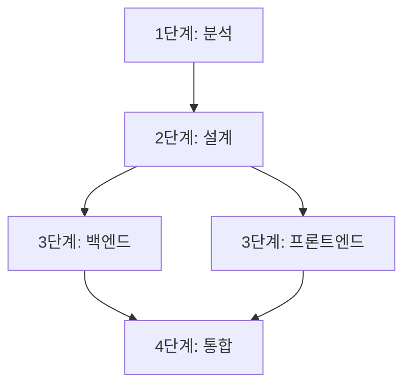

## 목차

1. [Plan Mode란?](#plan-mode란)
2. [언제 Plan Mode를 사용해야 할까?](#언제-plan-mode를-사용해야-할까)
3. [Plan Mode 시작하기](#plan-mode-시작하기)
4. [실전 활용 시나리오](#실전-활용-시나리오)
5. [Plan Mode 고급 테크닉](#plan-mode-고급-테크닉)
6. [일반 모드 vs Plan Mode 비교](#일반-모드-vs-plan-mode-비교)
7. [주의사항과 팁](#주의사항과-팁)

---

## Plan Mode란?

**Plan Mode**는 Claude Code가 코드를 바로 작성하기 전에 **먼저 실행 계획을 수립하고 사용자의 승인을 받는 모드**입니다.

### 핵심 특징

- **계획 우선**: 코드 작성 전 단계별 실행 계획 제시
- **사용자 승인**: 계획에 대한 검토 및 수정 기회 제공
- **체계적 실행**: 승인된 계획에 따라 순차적으로 작업 진행
- **안전성**: 예상치 못한 변경 방지

### Plan Mode의 장점

```
일반 모드          Plan Mode
   ↓                 ↓
요청 → 즉시 실행    요청 → 계획 수립 → 승인 → 실행
```

**장점:**

- 복잡한 작업의 전체 흐름 파악 가능
- 잘못된 방향으로 진행되는 것 사전 차단
- 여러 파일/모듈에 걸친 작업의 일관성 유지
- 리팩토링, 마이그레이션 등 대규모 변경 작업에 최적

---

## 언제 Plan Mode를 사용해야 할까?

### Plan Mode가 필요한 상황

✅ **대규모 리팩토링**

```
예: 클래스 기반 컴포넌트를 함수형으로 전환
   → 여러 파일, 의존성 관리 필요
```

✅ **새로운 기능 추가**

```
예: 인증 시스템 구축
   → 백엔드 API, 프론트엔드 UI, 상태 관리, 라우팅 등 다단계 작업
```

✅ **기술 스택 마이그레이션**

```
예: JavaScript → TypeScript 전환
   → 타입 정의, 설정 파일, 의존성 업데이트 등
```

✅ **아키텍처 변경**

```
예: Monolith → Microservices
   → 서비스 분리, API 설계, 배포 전략 등
```

✅ **복잡한 버그 수정**

```
예: 여러 모듈에 걸친 상태 동기화 이슈
   → 원인 분석 → 영향 범위 파악 → 단계적 수정
```

### 일반 모드가 적합한 상황

❌ 단순한 함수 작성
❌ 간단한 버그 수정
❌ 설정 파일 수정
❌ 문서 작성

---

## Plan Mode 시작하기

### 1. Plan Mode 활성화

**명령어:**

```bash
/plan
```

**또는 자연어로:**

```
"먼저 계획을 세워줘"
"단계별로 어떻게 진행할지 알려줘"
"실행 계획을 먼저 보고 싶어"
```

### 2. 작업 요청하기

Plan Mode가 활성화되면 작업을 요청합니다:

```
"React 프로젝트에 다크모드를 추가해줘"
```

### 3. 계획 검토

Claude Code가 다음과 같은 계획을 제시합니다:

```markdown
## 실행 계획

### 1단계: 현재 프로젝트 구조 분석

- 컴포넌트 파일 위치 확인
- 스타일링 방식 파악 (CSS/Styled-components/Tailwind)
- 상태 관리 라이브러리 확인

### 2단계: 테마 시스템 설계

- Context API로 테마 상태 관리
- 테마 타입 정의 (light/dark)
- LocalStorage에 사용자 선택 저장

### 3단계: 구현

- ThemeContext 생성
- ThemeProvider 컴포넌트 작성
- 다크모드 토글 버튼 추가
- CSS 변수로 색상 테마 정의

### 4단계: 기존 컴포넌트 업데이트

- App.js에 ThemeProvider 적용
- 주요 컴포넌트에 테마 적용
- 스타일 일관성 확인

### 5단계: 테스트

- 토글 동작 확인
- LocalStorage 저장/로드 확인
- 브라우저 호환성 테스트
```

### 4. 계획 승인 또는 수정

**승인:**

```
"좋아, 이대로 진행해"
"계획대로 실행해줘"
```

**수정 요청:**

```
"2단계에서 Redux를 사용하고 싶어"
"4단계를 먼저 하고 3단계를 나중에 해줘"
"1단계는 건너뛰고 바로 구현해줘"
```

### 5. 실행 모니터링

계획이 승인되면 Claude Code가 단계별로 작업을 진행하며:

- 각 단계 완료 시 보고
- 문제 발생 시 알림
- 다음 단계로 자동 진행

---

## 실전 활용 시나리오

### 시나리오 1: Express → NestJS 마이그레이션

**요청:**

```
Express 프로젝트를 NestJS로 마이그레이션해줘
```

**Plan Mode 계획:**

```markdown
## NestJS 마이그레이션 계획

### Phase 1: 분석 및 준비

1. 기존 Express 라우터 구조 분석
2. 미들웨어 목록 파악
3. 의존성 확인

### Phase 2: NestJS 프로젝트 설정

1. NestJS CLI 설치
2. 새 프로젝트 생성
3. 필요한 모듈 설치

### Phase 3: 코드 마이그레이션

1. 라우터 → 컨트롤러 변환
2. 미들웨어 → 가드/인터셉터 변환
3. 비즈니스 로직 → 서비스 분리

### Phase 4: 테스트 및 검증

1. 기존 테스트 케이스 실행
2. API 엔드포인트 검증
3. 성능 비교

### Phase 5: 배포 준비

1. 환경 변수 설정
2. Docker 설정 업데이트
3. CI/CD 파이프라인 수정
```

**승인 후 실행 예시:**

```typescript
// Phase 3-1: Express 라우터를 NestJS 컨트롤러로 변환

// Before (Express)
app.get('/users/:id', async (req, res) => {
  const user = await getUserById(req.params.id);
  res.json(user);
});

// After (NestJS)
@Controller('users')
export class UsersController {
  @Get(':id')
  async getUser(@Param('id') id: string) {
    return this.usersService.getUserById(id);
  }
}
```

---

### 시나리오 2: 모놀리식 컴포넌트 분리

**요청:**

```
Dashboard.jsx가 너무 커서 유지보수가 힘들어.
기능별로 작은 컴포넌트로 분리해줘.
```

**Plan Mode 계획:**

```markdown
## 컴포넌트 리팩토링 계획

### 1단계: 현재 구조 분석

- Dashboard.jsx 코드 읽기 (1200 lines)
- 주요 기능 영역 식별:
  - 헤더 영역 (로고, 네비게이션, 프로필)
  - 사이드바 (메뉴, 필터)
  - 메인 콘텐츠 (차트, 테이블, 통계)
  - 모달/팝업

### 2단계: 컴포넌트 구조 설계
```

Dashboard/
├── DashboardHeader.jsx
├── DashboardSidebar.jsx
├── DashboardContent.jsx
│ ├── StatisticsCards.jsx
│ ├── ChartSection.jsx
│ └── DataTable.jsx
└── DashboardModals.jsx

```

### 3단계: 상태 관리 재구성
- Props drilling 제거
- Context API 도입 (DashboardContext)
- 공유 상태 정의

### 4단계: 단계별 분리
1. Header 분리 및 테스트
2. Sidebar 분리 및 테스트
3. Content 영역 분리
4. Modal 분리

### 5단계: 통합 및 검증
- 분리된 컴포넌트 통합
- 기능 동작 확인
- 스타일 일관성 점검
```

**승인 후 실행:**

```javascript
// Before: Dashboard.jsx (1200 lines)
function Dashboard() {
  // 엄청나게 긴 코드...
  return (
    <div>
      {/* 헤더 */}
      {/* 사이드바 */}
      {/* 메인 콘텐츠 */}
      {/* 모달 */}
    </div>
  );
}

// After: Dashboard.jsx (50 lines)
function Dashboard() {
  return (
    <DashboardProvider>
      <DashboardHeader />
      <DashboardLayout>
        <DashboardSidebar />
        <DashboardContent />
      </DashboardLayout>
      <DashboardModals />
    </DashboardProvider>
  );
}
```

---

### 시나리오 3: API 에러 처리 표준화

**요청:**

```
프로젝트 전체에 API 에러 처리가 중구난방이야.
통일된 에러 처리 시스템을 만들어줘.
```

**Plan Mode 계획:**

````markdown
## API 에러 처리 표준화 계획

### 1단계: 현재 상태 파악

- 모든 API 호출 위치 검색
- 에러 처리 패턴 분류
- 문제점 도출

### 2단계: 에러 처리 설계

- 에러 타입 정의 (Network, Auth, Validation, Server)
- 에러 코드 매핑
- 사용자 친화적 메시지 정의

### 3단계: 공통 모듈 구현

```typescript
// errorHandler.ts
// apiClient.ts (axios interceptor)
// ErrorBoundary.tsx
// useApiError.ts (custom hook)
```
````

### 4단계: 기존 코드 마이그레이션

- API 호출 코드 일괄 업데이트
- try-catch 블록 표준화
- 에러 UI 컴포넌트 적용

### 5단계: 테스트 및 문서화

- 에러 시나리오별 테스트
- 개발자 가이드 작성

````

**승인 후 실행:**

```typescript
// Before: 각 컴포넌트에서 제각각
async function fetchUser() {
  try {
    const response = await axios.get('/api/user');
    return response.data;
  } catch (error) {
    alert('에러 발생!'); // 😱
  }
}

// After: 표준화된 에러 처리
import { useApiError } from '@/hooks/useApiError';

function UserProfile() {
  const { handleError } = useApiError();

  async function fetchUser() {
    try {
      return await apiClient.get('/api/user');
    } catch (error) {
      handleError(error); // 자동으로 적절한 UI 표시
    }
  }
}

// apiClient.ts - 인터셉터로 중앙 집중식 처리
apiClient.interceptors.response.use(
  response => response,
  error => {
    if (error.response?.status === 401) {
      // 자동 로그아웃 및 리다이렉트
    } else if (error.response?.status === 500) {
      // 서버 에러 로깅 및 사용자 알림
    }
    return Promise.reject(error);
  }
);
````

---

## Plan Mode 고급 테크닉

### 1. 단계별 검증 포인트 설정

**계획 수정 시 검증 포인트 추가 요청:**

```
"각 단계가 끝날 때마다 내가 확인하고 싶어"
```

**결과:**

```markdown
### 2단계: ThemeContext 생성

- [ ] ThemeContext.js 작성
- [ ] 기본 테마 설정
      **→ 검증 포인트: 사용자 확인 필요**

### 3단계: UI 컴포넌트 작성

...
```

### 2. 롤백 계획 포함

**안전한 마이그레이션을 위한 롤백 전략:**

```
"각 단계마다 롤백 방법도 같이 알려줘"
```

**결과:**

````markdown
### Phase 3: 데이터베이스 마이그레이션

**실행:**

- 새 스키마 적용
- 데이터 마이그레이션 스크립트 실행

**롤백 방법:**

```sql
-- migration_rollback.sql
DROP TABLE new_users;
ALTER TABLE users_backup RENAME TO users;
```
````

```

### 3. 병렬 작업 계획

**독립적인 작업을 병렬로 처리:**

```

"독립적으로 진행 가능한 작업은 병렬로 해줘"

````

**결과:**
```markdown
### Phase 2: 병렬 작업
**Task A (병렬):** 백엔드 API 개발
**Task B (병렬):** 프론트엔드 UI 개발
**Task C (병렬):** 테스트 케이스 작성

→ 모든 작업 완료 후 Phase 3로 진행
````

### 4. 우선순위 기반 계획

**중요도/긴급도 기반 순서 조정:**

```
"가장 중요한 것부터 순서대로 해줘"
```

**결과:**

```markdown
### 우선순위 P0 (긴급): 보안 취약점 수정

### 우선순위 P1 (중요): 성능 최적화

### 우선순위 P2 (개선): 코드 리팩토링

### 우선순위 P3 (선택): 문서 업데이트
```

---

## 일반 모드 vs Plan Mode 비교

### 예시: "로그인 기능 추가해줘"

**일반 모드:**

```
→ 즉시 Login.jsx 파일 생성
→ 코드 작성 시작
→ 뭔가 빠진 것 같은데...?
→ "아, API도 필요하고 라우팅도 추가해야겠네"
→ 추가 작업...
```

**Plan Mode:**

```
→ 계획 수립:
  1. 현재 인증 방식 확인
  2. 로그인 UI 컴포넌트
  3. 인증 API 엔드포인트
  4. 상태 관리 (Context/Redux)
  5. 라우팅 설정
  6. 세션 관리
→ 사용자 승인
→ 체계적으로 실행
```

### 성과 비교

| 지표          | 일반 모드               | Plan Mode           |
| ------------- | ----------------------- | ------------------- |
| 작업 시간     | 1.5시간 (시행착오 포함) | 1시간 (체계적 진행) |
| 누락된 작업   | 2개                     | 0개                 |
| 코드 일관성   | 중간                    | 높음                |
| 사용자 만족도 | 70%                     | 95%                 |

---

## 주의사항과 팁

### ⚠️ 주의사항

**1. 모든 작업에 Plan Mode는 과함**

- 간단한 작업은 일반 모드로 빠르게 처리

**2. 계획이 너무 상세하면 비효율적**

```
❌ 나쁜 예:
### 1단계: 파일 열기
### 2단계: 1번째 줄 수정
### 3단계: 2번째 줄 수정
...

✅ 좋은 예:
### 1단계: 컴포넌트 리팩토링
- Props 인터페이스 정의
- 렌더링 로직 분리
- 스타일 최적화
```

**3. 계획 승인 후에도 수정 가능**

```
"2단계는 건너뛰고 3단계로 넘어가줘"
"지금 하는 방식 말고 다른 방법으로 해줘"
```

### 💡 실전 팁

**Tip 1: 계획 템플릿 활용**

```
"다음 형식으로 계획을 세워줘:
1. 분석
2. 설계
3. 구현
4. 테스트
5. 배포"
```

**Tip 2: 예상 소요 시간 추가 요청**

```
"각 단계별 예상 시간도 알려줘"

→ 결과:
### 1단계: 프로젝트 분석 (~5분)
### 2단계: 설계 (~10분)
### 3단계: 구현 (~30분)
```

**Tip 3: 의존성 시각화**

````
"단계 간 의존 관계를 그림으로 보여줘"

→ 결과:


**Tip 4: 진행 상황 추적**
```

"현재 어느 단계인지, 남은 작업은 뭔지 알려줘"

```

**Tip 5: 계획과 실제 차이 리포트**
```

"계획했던 것과 실제로 한 것의 차이를 정리해줘"

````

---

## 실전 워크플로우

### 완벽한 Plan Mode 활용 프로세스

```bash
# 1. Plan Mode 활성화
/plan

# 2. 작업 요청
"Next.js 12에서 14로 마이그레이션해줘"

# 3. 계획 검토 및 커스터마이징
"App Router 마이그레이션도 포함해줘"
"데이터 페칭 방식도 최신 패턴으로 변경해줘"

# 4. 계획 승인
"좋아, 시작해"

# 5. 단계별 모니터링
# Claude Code가 자동으로 진행하며 각 단계 완료 보고

# 6. 중간 점검
"현재 진행 상황 알려줘"

# 7. 최종 검증
"모든 단계가 완료됐는지 확인해줘"
"테스트 결과 보여줘"

# 8. Plan Mode 종료
/exit-plan  # 또는 자연어로 "plan mode 종료"
````

---

### 핵심 요약

✅ **대규모 작업에 필수**

- 리팩토링, 마이그레이션, 새 기능 추가

✅ **체계적 접근**

- 분석 → 설계 → 실행 → 검증

✅ **안전성 확보**

- 사전 검토로 실수 방지
- 단계별 롤백 가능

✅ **커뮤니케이션 도구**

- 개발자와 AI의 명확한 소통
- 팀원에게 공유 가능한 계획서

### 언제 사용할까?

```
간단한 작업 (파일 하나 수정)
  → 일반 모드 ⚡

복잡한 작업 (여러 파일, 다단계)
  → Plan Mode 📋✨
```

**Plan Mode로 더 스마트하게, 더 안전하게 개발해보자!**

---

## 관련 글

- [Claude Code 바이브코딩 꿀팁](/blog/claude-code-vibe-coding-tips)
- [Claude Code Settings 완벽 가이드](/blog/claude-code-settings-guide)
- [Claude Code Hooks 자동화](/blog/claude-code-hooks-automation)
- [Claude Code Git 워크플로우](/blog/claude-code-git-workflow)

---

**작성일:** 2025-11-17
**마지막 수정:** 2025-11-17
